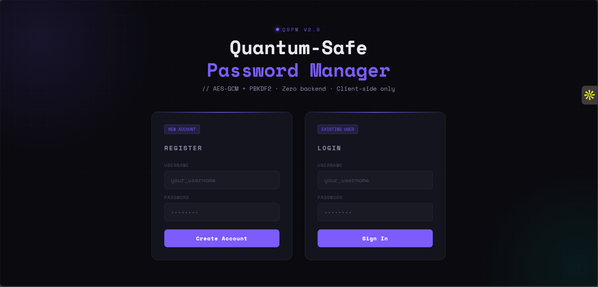
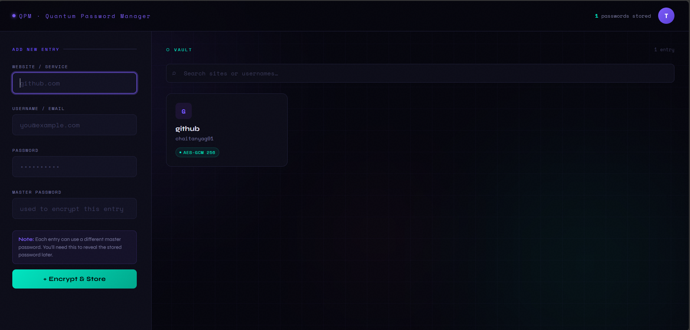

# ⬡ Quantum-Safe Password Manager

A fully client-side, zero-backend password manager secured with **real AES-GCM 256-bit encryption** and PBKDF2 key derivation. No server, no tracking, no data leaves your device.

**[Live Demo →](https://chaitanyagarware.github.io/quantum-password-manager)**





---

## 🔐 Security Architecture

| Layer | Implementation |
|-------|---------------|
| Encryption | AES-GCM 256-bit (Web Crypto API) |
| Key Derivation | PBKDF2 + SHA-256, 310,000 iterations (NIST recommended) |
| IV | Random 12-byte IV per entry |
| Salt | Random 16-byte salt per entry |
| Auth | SHA-256 hashed credentials, localStorage |
| Storage | Browser localStorage, fully client-side |

Every password entry is independently encrypted with a master password of your choice. The encrypted blob (salt + IV + ciphertext) is stored in `localStorage` — never transmitted anywhere.

---

## 🚀 Deploy to GitHub Pages (3 steps)

```bash
# 1. Fork or clone this repo
git clone https://github.com/YOUR_USERNAME/quantum-password-manager.git
cd quantum-password-manager

# 2. Push to GitHub
git add .
git commit -m "deploy"
git push origin main

# 3. Enable GitHub Pages
# Go to repo Settings → Pages → Source: Deploy from branch → Branch: main / (root)
```

Your site will be live at `https://YOUR_USERNAME.github.io/quantum-password-manager`

That's it. No npm install, no build step, no environment variables.

---

## 🗂 Project Structure

```
quantum-password-manager/
├── index.html          # Entire app — HTML + CSS + JS in one file
└── README.md
```

The entire app is a single `index.html`. Zero dependencies, zero build tools.

---

## 💡 How It Works

1. **Register** — creates a local account (SHA-256 hashed, stored in localStorage)
2. **Login** — unlocks your vault
3. **Add Entry** — encrypts the password with AES-GCM using your master password
4. **Reveal** — re-derives the key from your master password and decrypts inline

The master password is **never stored** — it's used to derive the AES key on demand via PBKDF2. If you forget a master password, that entry is permanently unrecoverable (by design).

---

## ⚠️ Important Notes

- Data is stored in **your browser's localStorage**. Clearing browser data will delete your vault.
- This is a **portfolio/demo project** — for production use, consider a dedicated password manager (Bitwarden, 1Password).
- The "quantum-safe" branding reflects the post-quantum crypto research inspiration behind the project.

---

## 🧑‍💻 Built By

**Chaitanya Garware** — MS Cybersecurity, University of Alabama at Birmingham  
[Portfolio](https://chaitanyagarware.github.io) · [LinkedIn](https://linkedin.com/in/chaitanyagarware) · [GitHub](https://github.com/chaitanyagarware01)

---

## 📄 License

MIT
